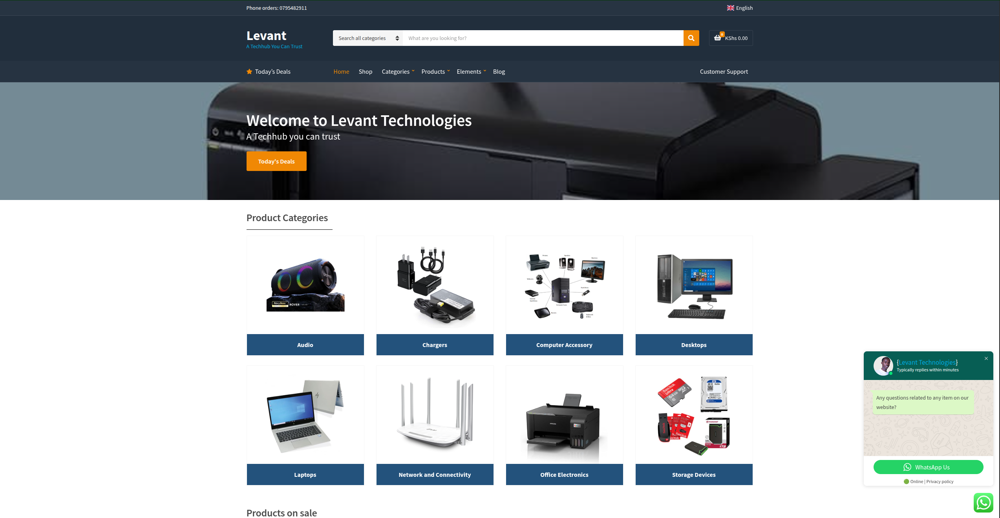

# 👋🏾 Hey, I'm Muhindi!

I'm a passionate web developer who recently transitioned into tech. After completing a front-end development course at Moringa School, I’ve built strong skills in HTML, CSS, JavaScript, React, and WordPress. I’m now diving into back-end development to become a Fullstack Web Developer. I’m driven to create user-focused web solutions that improve business processes and customer experiences. Open to collaboration, mentorship, and internship opportunities—let’s connect!

<table>
  <tr>
    <td align="center">
        <h3>💫 Fun Facts</h3>
        
☕️ <strong>JavaScript</strong> was the first programming language I learned!

        
🨠When I'm not coding, I love graphic design and swimming.

        
🌠I'm passionate about building solutions that simplify business logistics and improve customer experiences.

         
    </td>
    <td align="center">
        <h3>💻 Languages & Tools</h3>
        
    </td>
  </tr>
  <tr>
    <td align="center"> 
        <h3>🌟 My Latest Project</h3>
        <a href="https://levanttechnologies.co.ke/">
            
             Levant Technologies Website
        </a>
    </td>
    <td align="center">
        <h3>📚 My Favorite Tech Resources</h3>
        <a href="https://www.youtube.com/@BroCodez">
            
             Bro Code Tutorials
        </a>
    </td>
   </tr> 
   <tr>
    <td>
        <h3 style="text-align: center" align="center" valign="top">📖 Currently Learning</h3> 
        <ul>
            <li>Backend Development with <strong>Python</strong></li>
            <li><strong>Figma</strong> to create beautiful UI/UX designs</li>
            <li>Expanding my JavaScript and React skills</li>
        </ul>
    </td>
    <td align="center">
        <h3>👷🏾‍♀️ Currently Building</h3>
        
        
I'm currently building an <a href="https://levanttechnologies.co.ke/">Levant Technologies website</a> and I'll use JavaScript to program it!
 
    </td>
  </tr>
  <tr>
    <td colspan="2" align="center"> 
        <h3>🌠Let's Connect!</h3> 
        
        
    </td>
  </tr>
</table>
